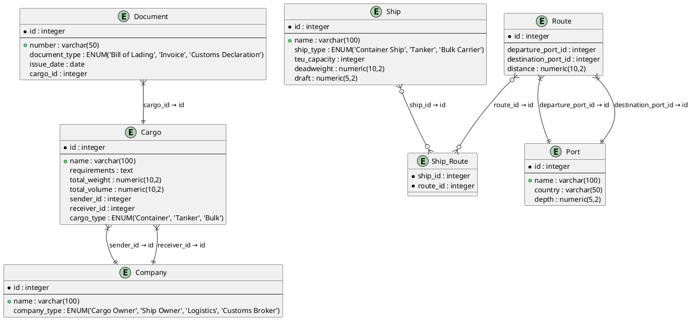

### **Отчёт по лабораторной работе №3**  
**Имя студента**: Возжаев Семен Николаевич  
**Группа**: Р4150  
**Дата выполнения**: 20.03.2025  
**Дисциплина**: Взаимодействие с базами данных  

---

#### **Описание предметной области**  
**Домен**: Организация морских перевозок грузов.  
**Границы**:  
- Включено: управление грузами, судами, портами, маршрутами, документами и участниками (грузовладельцы, судовладельцы).  

---

#### **Список сущностей и их классификация**  
| Сущность          | Тип               | Описание                                  |
|-------------------|-------------------|------------------------------------------|
| **Cargo**         | Стержневая        | Основной объект перевозки.               |
| **Ship**          | Стержневая        | Транспортное средство для перевозки.     |
| **Port**          | Стержневая        | Место погрузки/разгрузки.                |
| **Route**         | Ассоциация        | Путь следования судна между портами.     |
| **Company**       | Стержневая        | Участники процесса (отправитель, получатель). |
| **Document**      | Характеристика    | Юридическое сопровождение груза.         |

---

#### **Инфологическая модель (ER-диаграмма)**  



---

#### **Даталогическая модель (PostgreSQL)**  

```sql
-- Таблица Company
CREATE TABLE company (
  id SERIAL PRIMARY KEY,
  name VARCHAR(100) UNIQUE NOT NULL,
  company_type VARCHAR(30) CHECK (company_type IN ('Cargo Owner', 'Ship Owner', 'Logistics', 'Customs Broker')) NOT NULL
);

-- Таблица Cargo (ENUM вместо отдельной таблицы)
CREATE TABLE cargo (
  id SERIAL PRIMARY KEY,
  name VARCHAR(100) NOT NULL,
  requirements TEXT,
  total_weight NUMERIC(10,2) CHECK (total_weight > 0) NOT NULL,
  total_volume NUMERIC(10,2) CHECK (total_volume > 0) NOT NULL,
  sender_id INTEGER REFERENCES company(id) NOT NULL,
  receiver_id INTEGER REFERENCES company(id) NOT NULL,
  cargo_type VARCHAR(50) CHECK (cargo_type IN ('Container', 'Tanker', 'Bulk')) NOT NULL
);

-- Таблица Ship
CREATE TABLE ship (
  id SERIAL PRIMARY KEY,
  name VARCHAR(100) NOT NULL,
  ship_type VARCHAR(20) CHECK (ship_type IN ('Container Ship', 'Tanker', 'Bulk Carrier')) NOT NULL,
  teu_capacity INTEGER CHECK (teu_capacity >= 0),
  deadweight NUMERIC(10,2) CHECK (deadweight > 0) NOT NULL,
  draft NUMERIC(5,2) CHECK (draft > 0) NOT NULL
);

-- Таблица Port
CREATE TABLE port (
  id SERIAL PRIMARY KEY,
  name VARCHAR(100) UNIQUE NOT NULL,
  country VARCHAR(50) NOT NULL,
  depth NUMERIC(5,2) CHECK (depth > 0) NOT NULL
);

-- Таблица Route
CREATE TABLE route (
  id SERIAL PRIMARY KEY,
  departure_port_id INTEGER REFERENCES port(id) NOT NULL,
  destination_port_id INTEGER REFERENCES port(id) NOT NULL,
  distance NUMERIC(10,2) CHECK (distance > 0) NOT NULL
);

-- Таблица Document
CREATE TABLE document (
  id SERIAL PRIMARY KEY,
  number VARCHAR(50) UNIQUE NOT NULL,
  document_type VARCHAR(30) CHECK (document_type IN ('Bill of Lading', 'Invoice', 'Customs Declaration')) NOT NULL,
  issue_date DATE NOT NULL,
  cargo_id INTEGER REFERENCES cargo(id) NOT NULL
);

-- Таблица Ship_Route (явная связь)
CREATE TABLE ship_route (
  ship_id INTEGER REFERENCES ship(id) NOT NULL,
  route_id INTEGER REFERENCES route(id) NOT NULL,
  PRIMARY KEY (ship_id, route_id)
);
---

#### **Тестовые данные**  
```sql
-- Company
INSERT INTO company (name, company_type) VALUES
  ('Global Goods Inc', 'Cargo Owner'),
  ('Ocean Trans Ltd', 'Ship Owner');

-- Cargo
INSERT INTO cargo (name, total_weight, total_volume, sender_id, receiver_id, cargo_type) VALUES
  ('Electronics from China', 15000.00, 25.3, 1, 1, 'Container');

-- Port
INSERT INTO port (name, country, depth) VALUES
  ('Shanghai Port', 'China', 15.5),
  ('Port of Rotterdam', 'Netherlands', 18.0);

-- Route
INSERT INTO route (departure_port_id, destination_port_id, distance) VALUES
  (1, 2, 10000.00);

-- Ship
INSERT INTO ship (name, ship_type, teu_capacity, deadweight, draft) VALUES
  ('Sea Giant', 'Container Ship', 8000, 200000.00, 12.5);

-- Ship_Route
INSERT INTO ship_route (ship_id, route_id) VALUES (1, 1);

-- Document
INSERT INTO document (number, document_type, issue_date, cargo_id) VALUES
  ('BL-2023-001', 'Bill of Lading', '2023-10-01', 1);
```

#### **1. Нормализация**  
Модель приведена к **3НФ**:  
- Все неключевые атрибуты зависят только от первичного ключа.  
- Нет транзитивных зависимостей.  

---

#### **2. Функциональные зависимости**  


1. **Таблица `cargo`**:  
   - `id → name, requirements, total_weight, total_volume, sender_id, receiver_id, cargo_type`.  
   - `sender_id → company.name` (через внешний ключ).  

2. **Таблица `ship`**:  
   - `id → name, ship_type, teu_capacity, deadweight, draft, route_id`.  
   - `route_id → route.distance`.  

3. **Таблица `document`**:  
   - `id → number, document_type, issue_date, cargo_id`.  
   - `cargo_id → cargo.name`.  

---

#### **3. Ограничения целостности (DDL)**  
 ```
- **`CHECK`**:  
  ```sql
 Cargo (
    total_weight NUMERIC(10,2) CHECK (total_weight > 0),
    total_volume NUMERIC(10,2) CHECK (total_volume > 0)
  );
  ```
 ```
- **`UNIQUE`**:  
  ```sql
port (
    name VARCHAR(100) UNIQUE NOT NULL
  );
  ```
 ```
- **`REFERENCES`**:  
  ```sql
ship (
    route_id INTEGER REFERENCES route(id)
  );
  ```

---

#### **4. Примеры SQL-запросов**  
---
#### **1. INNER JOIN: Грузы с документами**
```sql
SELECT cargo.name AS cargo_name, document.number AS doc_number
FROM cargo
INNER JOIN document ON cargo.id = document.cargo_id;
```
---
#### **2. LEFT JOIN: Все порты и их маршруты**
```sql
SELECT port.name AS port_name, route.distance
FROM port
LEFT JOIN route 
  ON port.id = route.departure_port_id OR port.id = route.destination_port_id;
```
---
#### **3. FULL JOIN: Судна и их маршруты**
```sql
SELECT ship.name AS ship_name, route.distance
FROM ship
FULL JOIN ship_route ON ship.id = ship_route.ship_id
FULL JOIN route ON ship_route.route_id = route.id;
```
---
#### **4. CROSS JOIN: Все комбинации грузов и портов**
```sql
SELECT cargo.name AS cargo_name, port.name AS port_name
FROM cargo 
CROSS JOIN port;
```
---
#### **5. JOIN USING: Грузы и их отправители**
```sql
SELECT cargo.name AS cargo_name, company.name AS sender
FROM cargo
JOIN company ON cargo.sender_id = company.id;
```
---
#### **6. NATURAL JOIN: Документы и грузы**
```sql
SELECT * FROM cargo
NATURAL JOIN document;
```
---
#### **7. RIGHT JOIN: Маршруты и порты назначения**
```sql
SELECT route.distance, port.name AS destination_port
FROM route
RIGHT JOIN port ON route.destination_port_id = port.id;
```
---
#### **8. OUTER JOIN: Судна без маршрутов**
```sql
SELECT ship.name AS ship_name
FROM ship
LEFT JOIN ship_route ON ship.id = ship_route.ship_id
WHERE ship_route.route_id IS NULL;
```
---
#### **9. Соединение через WHERE: Грузы отправителя "Global Goods Inc"**
```sql
SELECT cargo.name, port.name AS departure_port
FROM cargo, route, port
WHERE 
  cargo.sender_id = (SELECT id FROM company WHERE name = 'Global Goods Inc') 
  AND route.departure_port_id = port.id;
```
---

