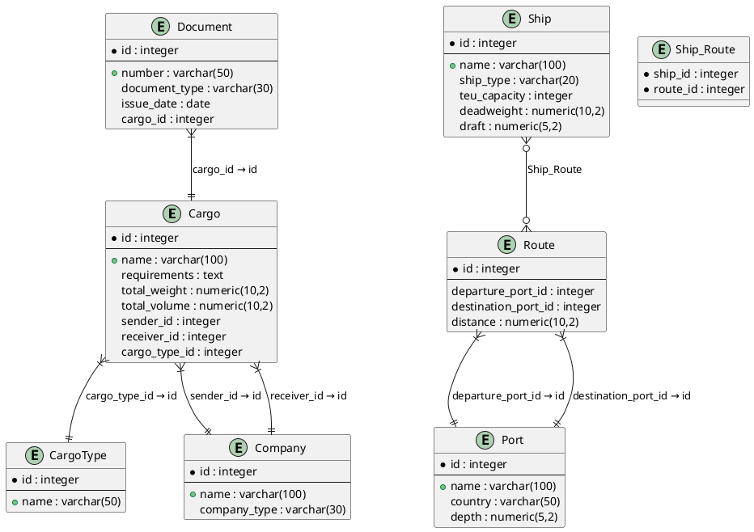

### **Отчёт по лабораторной работе 2: Морские перевозки грузов**

---

#### **1. Описание предметной области**  
**Домен**: Организация морских перевозок грузов.  
**Границы**:  
- Включено: управление грузами, судами, портами, маршрутами, документами и участниками (грузовладельцы, судовладельцы).  

---

#### **2. Список сущностей и их классификация**  
| Сущность          | Тип               | Описание                                  |
|-------------------|-------------------|------------------------------------------|
| **Cargo**         | Стержневая        | Основной объект перевозки.               |
| **CargoType**     | Характеристика    | Категория груза (контейнер, наливной).   |
| **Ship**          | Стержневая        | Транспортное средство для перевозки.     |
| **Port**          | Стержневая        | Место погрузки/разгрузки.                |
| **Route**         | Ассоциация        | Путь следования судна между портами.     |
| **Company**       | Стержневая        | Участники процесса (отправитель, получатель). |
| **Document**      | Характеристика    | Юридическое сопровождение груза.         |

---

#### **3. Инфологическая модель (ER-диаграмма)**  



---

#### **4. Даталогическая модель (PostgreSQL)**  

##### **Таблицы**  
```sql
-- Компании
CREATE TABLE company (
  id SERIAL PRIMARY KEY,
  name VARCHAR(100) UNIQUE NOT NULL,
  company_type VARCHAR(30) CHECK (company_type IN ('Cargo Owner', 'Ship Owner', 'Logistics', 'Customs Broker'))
);

-- Типы грузов
CREATE TABLE cargo_type (
  id SERIAL PRIMARY KEY,
  name VARCHAR(50) NOT NULL
);

-- Грузы
CREATE TABLE cargo (
  id SERIAL PRIMARY KEY,
  name VARCHAR(100) NOT NULL,
  requirements TEXT,
  total_weight NUMERIC(10,2) CHECK (total_weight > 0),
  total_volume NUMERIC(10,2) CHECK (total_volume > 0),
  sender_id INTEGER REFERENCES company(id),
  receiver_id INTEGER REFERENCES company(id),
  cargo_type_id INTEGER REFERENCES cargo_type(id)
);

-- Судна
CREATE TABLE ship (
  id SERIAL PRIMARY KEY,
  name VARCHAR(100) NOT NULL,
  ship_type VARCHAR(20) CHECK (ship_type IN ('Container Ship', 'Tanker', 'Bulk Carrier')),
  teu_capacity INTEGER CHECK (teu_capacity >= 0),
  deadweight NUMERIC(10,2) CHECK (deadweight > 0),
  draft NUMERIC(5,2) CHECK (draft > 0)
);

-- Порты
CREATE TABLE port (
  id SERIAL PRIMARY KEY,
  name VARCHAR(100) UNIQUE NOT NULL,
  country VARCHAR(50) NOT NULL,
  depth NUMERIC(5,2) CHECK (depth > 0)
);

-- Маршруты
CREATE TABLE route (
  id SERIAL PRIMARY KEY,
  departure_port_id INTEGER REFERENCES port(id),
  destination_port_id INTEGER REFERENCES port(id),
  distance NUMERIC(10,2) CHECK (distance > 0)
);

-- Документы
CREATE TABLE document (
  id SERIAL PRIMARY KEY,
  number VARCHAR(50) UNIQUE NOT NULL,
  document_type VARCHAR(30) CHECK (document_type IN ('Bill of Lading', 'Invoice', 'Customs Declaration')),
  issue_date DATE NOT NULL,
  cargo_id INTEGER REFERENCES cargo(id)
);

-- Связь Судно ↔ Маршрут (многие-ко-многим)
CREATE TABLE ship_route (
  ship_id INTEGER REFERENCES ship(id),
  route_id INTEGER REFERENCES route(id),
  PRIMARY KEY (ship_id, route_id)
);
```

---

#### **5. Реализация на SQL**  
Все связи обеспечены внешними ключами (`REFERENCES`), добавлены ограничения:  
- `CHECK` для числовых полей (вес, объем, глубина и т.д.).  
- `UNIQUE` для уникальных значений (название порта, номер документа).  
- `PRIMARY KEY` для связей «многие-ко-многим» (таблица `ship_route`).  

---

#### **6. Тестовые данные**  
```sql
-- Компании
INSERT INTO company (name, company_type) VALUES
  ('Global Goods Inc', 'Cargo Owner'),
  ('Ocean Trans Ltd', 'Ship Owner');

-- Типы грузов
INSERT INTO cargo_type (name) VALUES
  ('20ft Container');

-- Грузы
INSERT INTO cargo (name, total_weight, total_volume, sender_id, receiver_id, cargo_type_id VALUES ('Electronics from China', 15000.00, 25.3, 1, 1, 1);

-- Порты
INSERT INTO port (name, country, depth) VALUES
  ('Shanghai Port', 'China', 15.5),
  ('Port of Rotterdam', 'Netherlands', 18.0);

-- Маршруты
INSERT INTO route (departure_port_id, destination_port_id, distance) VALUES
  (1, 2, 10000.00);

-- Судна
INSERT INTO ship (name, ship_type, teu_capacity, deadweight, draft) VALUES
  ('Sea Giant', 'Container Ship', 8000, 200000.00, 12.5);

-- Связь судно-маршрут
INSERT INTO ship_route VALUES (1, 1);

-- Документы
INSERT INTO document (number, document_type, issue_date, cargo_id) VALUES
  ('BL-2023-001', 'Bill of Lading', '2023-10-01', 1);
```

---

#### **7. Проверка работы**  
```sql
-- Все грузы с отправителями и типами
SELECT 
  cargo.name AS cargo_name,
  sender.name AS sender,
  receiver.name AS receiver,
  cargo_type.name AS cargo_type
FROM cargo
JOIN company AS sender ON cargo.sender_id = sender.id
JOIN company AS receiver ON cargo.receiver_id = receiver.id
JOIN cargo_type ON cargo.cargo_type_id = cargo_type.id;

-- Судна на маршруте Шанхай → Роттердам
SELECT 
  ship.name AS ship_name,
  port1.name AS departure_port,
  port2.name AS destination_port
FROM ship_route
JOIN ship ON ship_route.ship_id = ship.id
JOIN route ON ship_route.route_id = route.id
JOIN port AS port1 ON route.departure_port_id = port1.id
JOIN port AS port2 ON route.destination_port_id = port2.id;
```
